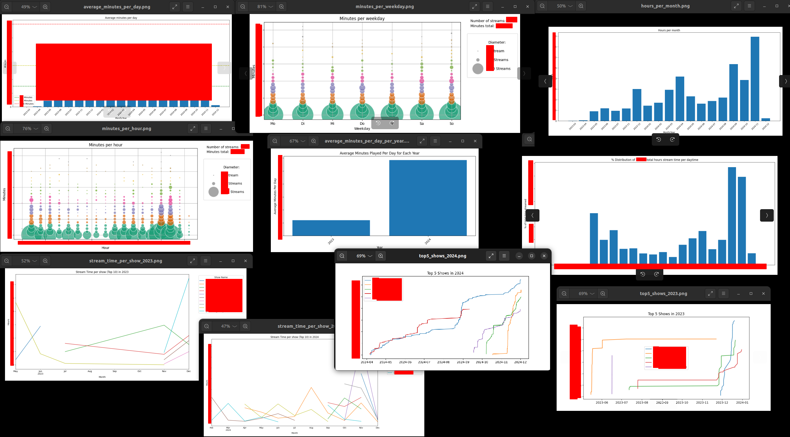
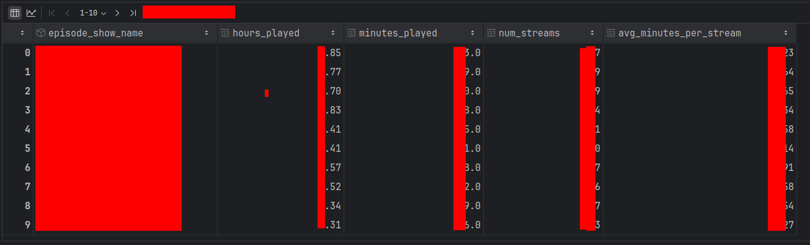

# Spotify Video Stream Analysis 📈📊🧐

Spotify has video podcasts. I do not like this feature, but my children do 🙄.
I am not able to disable it, so I decided to analyze the data and see what they are watching. The data I analyzed is
pretty interesting, so I decided to share the code with you. Maybe you can use it to analyze your own and your
children's data.

> **Don't blame them, talk to them** 

The following statistics are calculated:

- charts
    - average_minutes_per_day.png
    - average_minutes_per_day_per_year.png
    - hours_per_month.png
    - minutes_per_hour.png
    - minutes_per_weekday.png
    - percentage_distribution_per_hour.png
    - stream_time_per_show_2023.png
    - stream_time_per_show_2024.png
    - top5_shows_2023.png
    - top5_shows_2024.png
- csv (open with excel or similar)
    - show_stats_sorted_by_minutes.csv

## Some (anonymized) sample charts




## Usage

- Download your data from Spotify
    - follow these instructions up to (incl.) *5. Download and extract the
      files* => [Download your data](https://support.stats.fm/docs/import/spotify-import/#:~:text=Request%20your%20data%20from%20Spotify%E2%80%8B&text=To%20get%20started%2C%20open%20the,the%20%22Request%20data%22%20button.)
    - do not unzip the file, we just need the zip file
- Clone this repository and follow the *Local Setup* instructions

## Local Setup

We use jupyter notebooks to analyze the data. The following steps are necessary to set up the environment.
If you are experienced, just make sure you've installed the requirements and start the jupyter notebook.

**Important**: open the jupyter notebook *spotify.ipynb* and change the values under *CONFIGURATION* to your needs.

Look at the charts and csv files in the *output* folder.

```bash
# i use pyenv to manage python versions
# install and activate python 3.10
pyenv install 3.10
pyenv virtualenv 3.10 venv-3.10
pyenv activate venv-3.10

# upgrade pip
python -m pip install --upgrade pi
pip install --upgrade pip

# install requirements
pip install -r requirements.txt

# list installed venv, search the current one and use the path configure the python interpreter in the IDE
pyenv virtualenvs

# open your ide and configure the python interpreter to the one in the venv and start the jupyter notebook

# when you are done, deactivate the venv
# leave virtual environment
pyenv deactivate
```