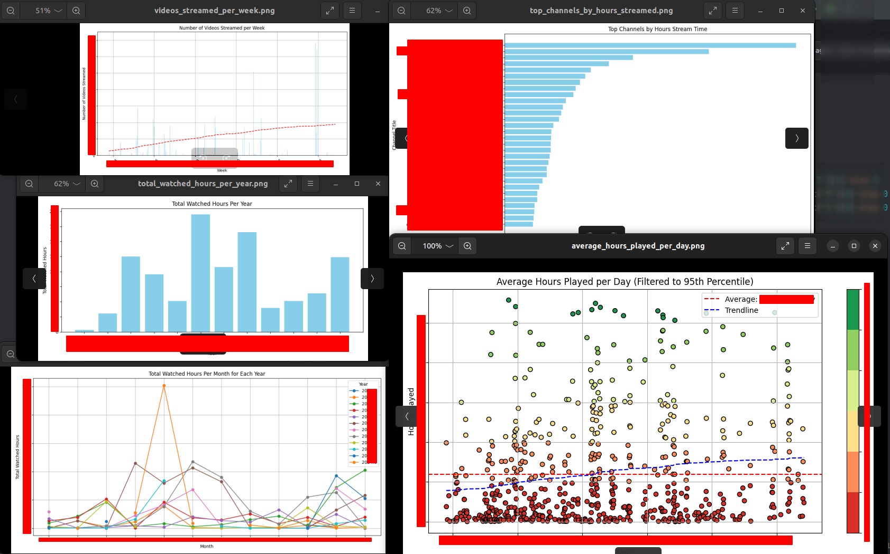
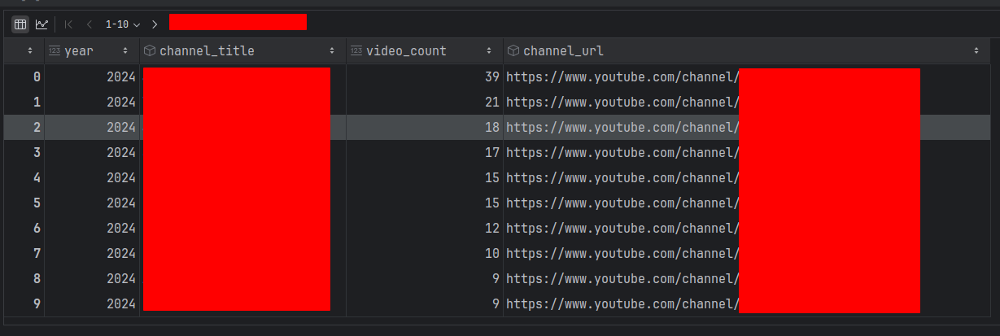

# YouTube Video Stream Analysis 📈📊🧐

The data I analyzed is pretty interesting, so I decided to share the code with you. Maybe you can use it to analyze your own and your
children's data.

> **Don't blame them, talk to them**

The following statistics are calculated:

- charts
  - average_hours_played_per_day.png
  - top_channels_by_hours_streamed.png
  - total_watched_hours_per_month.png
  - total_watched_hours_per_year.png
  - videos_streamed_per_week.png
- csv (open with Excel or similar)
  - all_videos_by_year_channel.csv
  - top_ten_channels_per_year.csv
  - videos_played_multiple_times.csv

## Some (anonymized) sample charts





## Usage

You'll need the YouTube watch history data AND a Google API key.

- YouTube:
  - Follow steps 1. - 7. (not the rest) [HERE](https://dev.to/ubershmekel/what-did-i-watch-most-on-youtube-1ol2)!
    - You should now have a file called *watch-history.json* if you've followed the instructions
- Google API Key:
  - Follow the instructions [HERE](https://www.getphyllo.com/post/how-to-get-youtube-api-key) to get a Google API key
    - You should now have a Google API Key which looks like this: *AIzaSyD.....* (keep it secret, keep it safe)
    - Save the key in a file called *~/.social_media_stats* like this: `GOOGLE_API_KEY=AIzaSyD.....`
    - Make sure the file is only readable by you: `chmod 600 ~/.social_media_stats`
- Clone this repository and follow the *Local Setup* instructions

BEWARE: The API Key has a quota of 10.000 requests per day. So if your watch history is huge, you might run into problems :-/  

## Local Setup

We use jupyter notebooks to analyze the data. The following steps are necessary to set up the environment.
If you are experienced, just make sure you've installed the requirements and start the jupyter notebook.

Make sure you followed the steps under *Google API key storage + Jupyter Notebook configuration* and the steps below to setup
your local python environment.

- ```config.py``` change the values under *CONFIGURATION* to your needs.
- ```01_setup.ipynb``` will setup local folders and tell your where the data will be stored
- ```02_quick_stats_no_api_key.ipynb``` generates some quick statistics without the need of the Google API key
- ```03_download_video_details.ipynb``` will download video details from YouTube (via the API) and your API key
- ```03_generate_stats.ipynb``` will generate the statistics
- look at the charts and csv files in the *output* folder

Execute the notebooks in the given order.

BEWARE: only execute *03_download_video_details.ipynb* once, as it will download all video details from YouTube and stores them locally.

### Creating a virtual environment with all dependencies

```bash
# i use pyenv to manage python versions
# install and activate python 3.10
pyenv install 3.10
pyenv virtualenv 3.10 venv-3.10
pyenv activate venv-3.10

# upgrade pip
python -m pip install --upgrade pi
pip install --upgrade pip
# for clearing the cache
pip install --upgrade nbstripout

# install requirements
pip install -r requirements.txt

# list installed venv, search the current one and use the path configure the python interpreter in the IDE
pyenv virtualenvs

# open your ide and configure the python interpreter to the one in the venv and start the jupyter notebook

# when you are done, deactivate the venv
# leave virtual environment
pyenv deactivate
```

## Google API key storage + Jupyter Notebook configuration

As explained above, you need to store the Google API key in a file called *~/.social_media_stats* like this: `GOOGLE_API_KEY=AIzaSyD.....`

```bash
# c.NotebookApp.iopub_data_rate_limit = 1.0e10
vi ~/.jupyter/jupyter_notebook_config.py

# GOOGLE_API_KEY=xxxxx
vi ~/.social_media_stats
chmod 600 ~/.social_media_stats
```